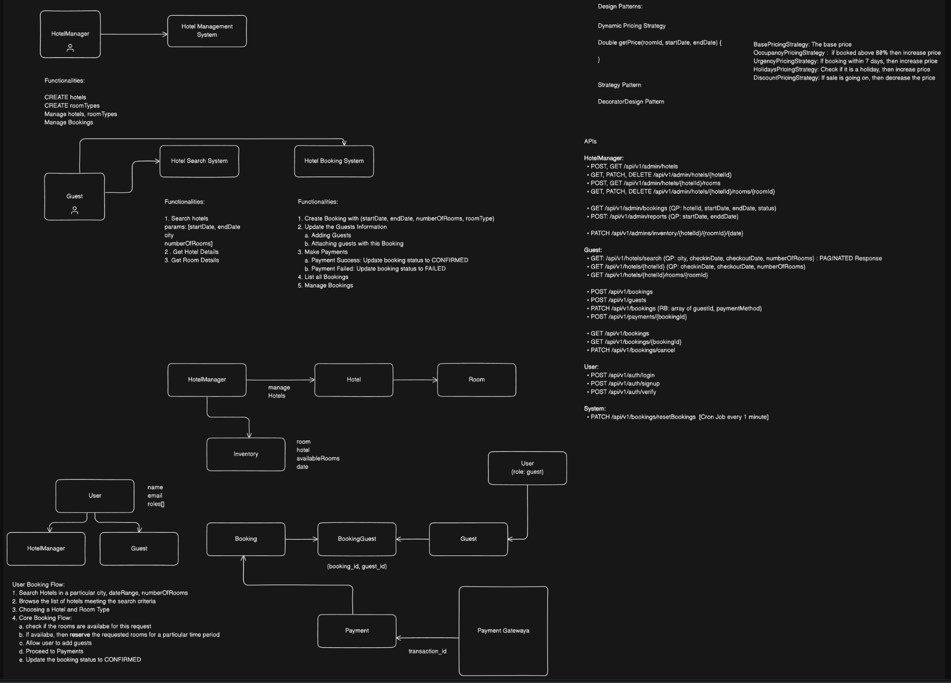
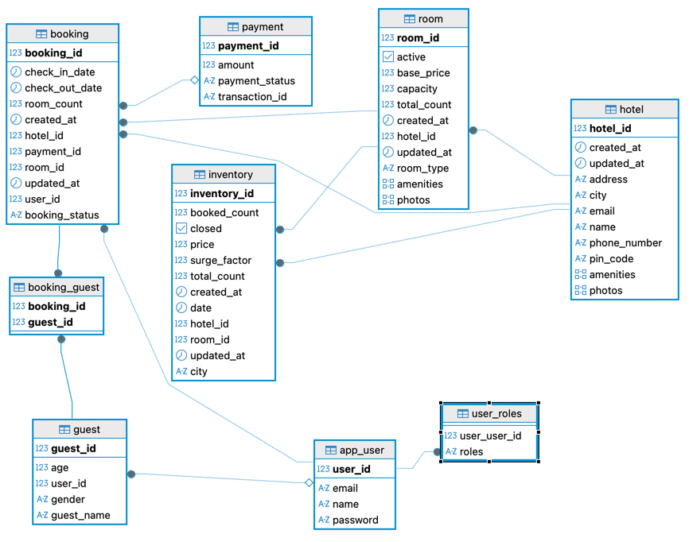
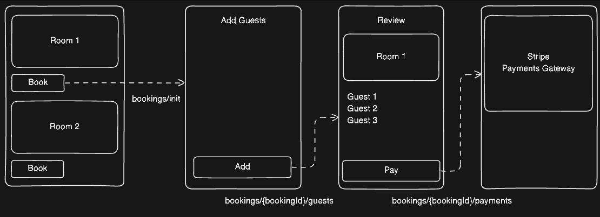

# AirBnB

### HLD of AirBnb
[HLD Diagram Good Quality Link](https://cs-prod-assets-bucket.s3.ap-south-1.amazonaws.com/diagram_export_23_11_2024_23_28_48_7c4f0f0be2.png)

### DFD of AirBnB

### Flow of User Booking room

### Features
1. Create hotels
2. Activate Hotels, once activated then one year inventory get created
3. De activate hotels
3. Add rooms in the hotel
4. Delete rooms, hotel,
5. Dynamic Pricing of hotel based on urgency, holidays, occupancy, using Decorator Pattern and Scheduling
4. Search Rooms based on city, number of rooms, check-in and checkout date
6. Hotel Booking
7. Stripe Payment Gateway for Payments and Refund and Receipt Generation
8. Role based authentication and authorization